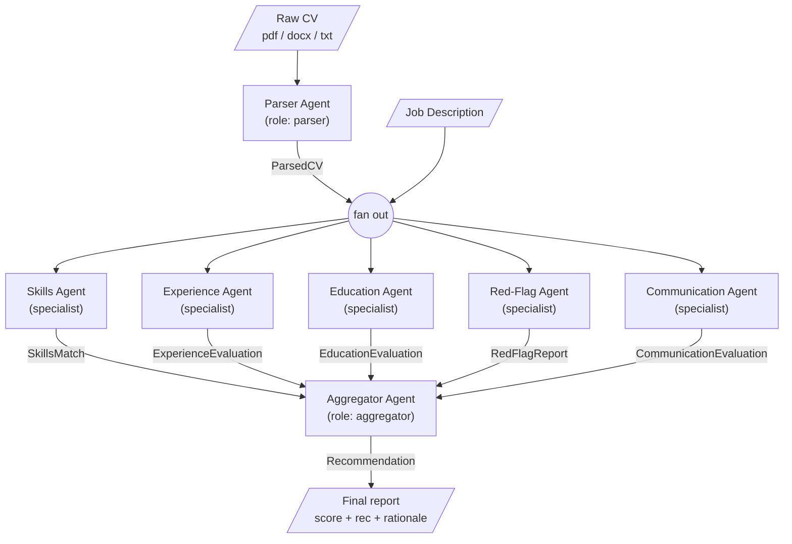

# CV Screener — Design

Multi-agent CV screening built on Pydantic AI + LiteLLM, talking to Together AI.
Three model roles are configurable via env (`CV_SCREENER_MODEL_PARSER`,
`CV_SCREENER_MODEL_SPECIALIST`, `CV_SCREENER_MODEL_AGGREGATOR`).

## Pipeline



## The 5 specialists (run in parallel)

Each specialist gets the **same input** (`ParsedCV` + `JobDescription`, plus the
raw CV excerpt where noted) and is responsible for one narrow judgement.
They never call each other; they only emit their typed output for the
aggregator. This is what each one is told to do:

### 1. Skills Agent → `SkillsMatch`
**Job:** decide how well the candidate's skill set covers the JD.
- Bucket every JD `required_skills` / `nice_to_have_skills` entry as
  matched / missing, allowing reasonable synonyms (e.g. "PG" → "Postgres").
- Score 0–100 weighted toward required skills (missing-required is heavily
  penalised; missing-nice-to-have is a small deduction).
- Notes call out close-but-not-exact matches and skills inferred from project
  descriptions rather than the explicit skills list.

### 2. Experience Agent → `ExperienceEvaluation`
**Job:** decide whether the candidate's career shape fits the role.
- Compute `years_relevant` (only count roles whose responsibilities match the
  JD domain — not total YoE).
- Judge `progression_signal` from title/scope trajectory across roles.
- Score `domain_match` (industry/problem-space) and `scope_match` (team size,
  system complexity, seniority) separately; combine into `exp_score`.
- Inputs: `ParsedCV.experience` + `JobDescription`.

### 3. Education Agent → `EducationEvaluation`
**Job:** decide whether formal background + certifications clear the bar.
- Set `degree_match` against JD requirements (treat unstated requirements as
  satisfied; never invent a requirement).
- Classify `institution_tier` conservatively — default to `unknown` rather
  than guessing.
- Surface only certifications relevant to the JD; ignore generic ones.

### 4. Red-Flag Agent → `RedFlagReport`
**Job:** find concrete problems a reviewer would want to ask about.
- Flag gaps > 6 months, tenures < 9 months that aren't internships,
  inconsistencies (dates, claimed-vs-listed tech), and missing fields the JD
  implicitly needs (e.g. no contact info, no dates).
- `severity = high` only if a flag would plausibly block an offer.
- Inputs: `ParsedCV` only — does **not** see the JD, so it stays objective.

### 5. Communication Agent → `CommunicationEvaluation`
**Job:** judge how the candidate *writes*, not what they wrote about.
- Score `clarity_score` and `structure_score` from the raw CV text (bullets
  vs. wall-of-text, tense consistency, action verbs, measurable outcomes).
- Estimate `language_proficiency` from prose quality only; leave `None` if
  the CV is too short to judge.
- `notable_issues` is short — typos, run-on bullets, missing impact metrics.
- Inputs: raw CV text excerpt + `ParsedCV.summary` (not the JD).

### Aggregator → `Recommendation`
Reductive only. Reads the five typed outputs + `JobDescription`, never
re-reads the raw CV. Produces `overall_score`, a categorical
`recommendation`, and 3–5 interview questions targeted at the weakest area.

All payloads are Pydantic models from
[../src/cv_screener/models.py](../src/cv_screener/models.py); the only
free-form strings crossing boundaries are the parser's raw input and the
aggregator's final `rationale`.

## Execution shape

- **Stage 1 (Parser)** runs first — everything downstream needs `ParsedCV`.
- **Stage 2 (5 Specialists)** runs concurrently via `asyncio.gather`. Each
  specialist is independent, side-effect free, sees only the inputs listed
  above, and emits exactly one typed Pydantic model.
- **Stage 3 (Aggregator)** is purely reductive: it never re-reads the CV, it
  only reasons over the five typed specialist outputs + the JD.

Why 5 and not more: each specialist costs one LLM round-trip in parallel, so
the wall-clock is `max()` not `sum()`. Adding a sixth agent only helps if its
judgement isn't already a slice of one of these five — keep the set
orthogonal.

## Model routing

LiteLLM is the single client; the three role env vars pick which
Together-hosted model serves each role. Defaults (cheapest viable) live in the
agent factory; overrides let you swap in a stronger model for the aggregator
without touching code.

```
parser       → CV_SCREENER_MODEL_PARSER       (cheap, fast, JSON-strict)
specialists  → CV_SCREENER_MODEL_SPECIALIST   (cheap, parallel x5)
aggregator   → CV_SCREENER_MODEL_AGGREGATOR   (stronger; final judgement)
```

## Layout

```
src/cv_screener/
  __init__.py
  models.py         # all Pydantic contracts (current file)
  cli.py            # `cv-screener` entry point (not yet written)
  agents/
    parser.py       # ParsedCV
    skills.py       # SkillsMatch
    experience.py   # ExperienceEvaluation
    education.py    # EducationEvaluation
    red_flags.py    # RedFlagReport
    communication.py# CommunicationEvaluation
    aggregator.py   # Recommendation
examples/
  jd_example.md
  cv_example.txt
```
